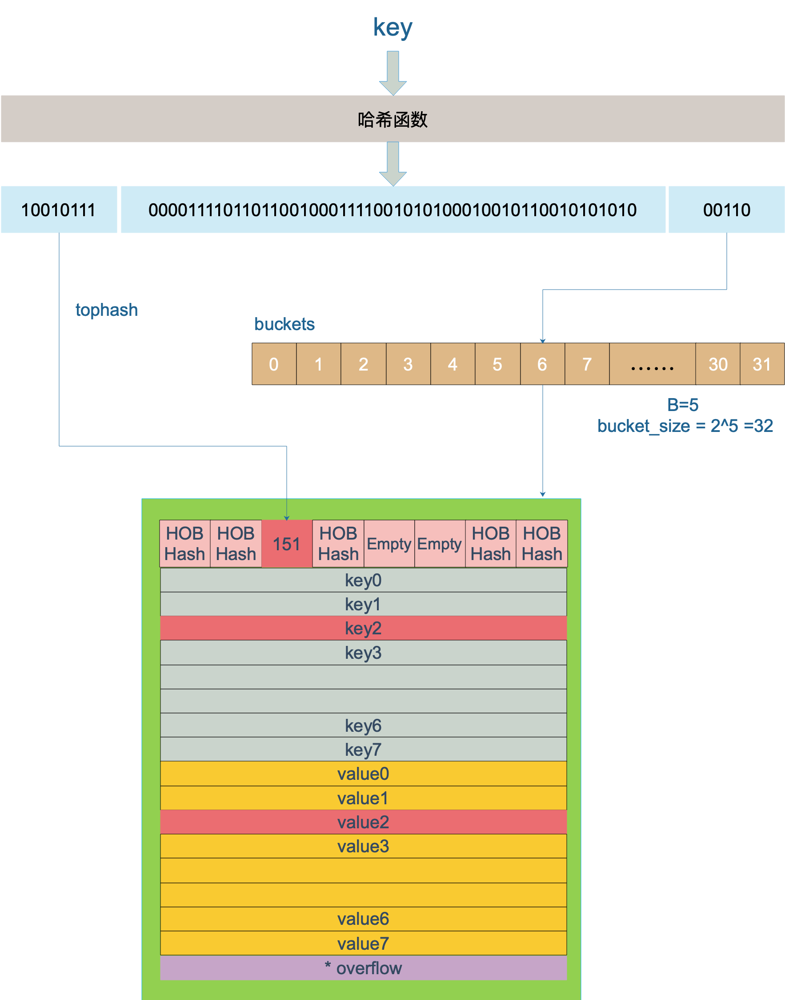

## map 原理部分
### 1. Map存储结构
```go
type hmap struct {
    count     int    // 元素个数
    flags     uint8  // 用来标记状态
    B         uint8  // 扩容常量相关字段B是buckets数组的长度的对数 2^B
    noverflow uint16 // noverflow是溢出桶的数量，当B<16时，为精确值,当B>=16时，为估计值                    
    hash0     uint32 // 是哈希的种子，它能为哈希函数的结果引入随机性，这个值在创建哈希表时确定，并在调用哈希函数时作为参数传入
    
    buckets    unsafe.Pointer // 桶的地址 
    oldbuckets unsafe.Pointer // 旧桶的地址，用于扩容 
    nevacuate  uintptr        // 搬迁进度，扩容需要将旧数据搬迁至新数据，这里是利用指针来比 较判断有没有迁移 
    
    extra *mapextra // 用于扩容的指针
}

type mapextra struct {
    overflow    *[]*bmap  // 已经被使用的所有溢出桶的地址
    oldoverflow *[]*bmap  // 扩容时，原桶一使用的溢出桶地址
    // nextOverflow holds a pointer to a free overflow bucket.
    nextOverflow *bmap    // 指向下一个空闲溢出桶的指针
}

// A bucket for a Go map.
type bmap struct {
    tophash [bucketCnt]uint8  // tophash 用于记录8个key哈希值的高8位，这样在寻找对应key的时候可以更快，不必每次都对key做全等判断
}

// 实际上编辑期间会动态生成一个新的结构体
type bmap struct {
    topbits  [8]uint8
    keys     [8]keytype
    values   [8]valuetype
    pad      uintptr
    overflow uintptr
}
```


### 2. 初始化
```go
    m := make(map[string]string,10)
```
1. 创建 hmap 对象
2. 生成hash0 并赋值到hmap 中，用于后续为key创建哈希值
3. 根据容量计算 B 的大小，当前 B 为 1
    ```text
    hint    B
    0-8     0
    9-13    1
    14-26   2
    ```
4. 根据 B 去创建桶，并存储在 buckets 数值中。
   - 当 B < 4, 根据B的规则创建 2^B^ 个标准桶。
   - 当 B >= 4, 根据B的规则创建 2^B^ + 2^B-4^ 个桶，（标准桶 + 溢出桶）。

### 3. 写入数据
```text
m["name"] = "haha"
```
内部处理流程：
   1. 结合 hash0 和 `name` key 生成哈希值。
   2. 获取哈希值的后 `B` 位的值，来决定这个键值对存放在那个桶中。
      ```text
      将 哈希值 和 桶掩码 进行 & 运算，最终得到哈希值的最后 `B` 位的值。
      哈希值：10010111 | 000011110110110010001111001010100010010110010101010 │ 00110
      桶掩码：11111
      结果： 00110  6
      ```
   3. 在确定好存放的桶之后，接下来就写入数据。
      ```text
      获取哈希值的高8位（tophash），将tophash、key、value 分别写入到桶中的三个数组中。
      如果桶已经满了，则通过overflow 找到溢出桶，并在溢出桶中继续写入。
      ```
   4. hmap 的个数 count ++ 

### 4. 读取数据
```text
_ = m["name"]
```
内部读取流程： 
  1. 结合 hash0 和 `name` key 生成哈希值。 
  2. 获取哈希值的后 `B` 位的值，来决定这个键应该去那个桶中找。
     ```text
     将 哈希值 和 桶掩码 进行 & 运算，最终得到哈希值的最后 `B` 位的值。
     哈希值：10010111 | 000011110110110010001111001010100010010110010101010 │ 00110
     桶掩码：11111
     结果： 00110  6
     ```

3. 在确定好存放的桶之后，根据 tophash 在桶中查找数据。
     
     上图中，假定 B = 5，所以 bucket 总数就是 2^5 = 32。首先计算出待查找 key 的哈希，使用低 5 位 00110，找到对应的 6 号 bucket，使用高 8 位 10010111，对应十进制 151，在 6 号 bucket 中寻找 tophash 值（HOB hash)为 151 的 key，找到了 2 号槽位，这样整个查找过程就结束了。

### 5. 扩容 和 迁移
在达到某一个条件的时候，会触发扩容。
  1. map 中数据的总数/桶个数 > 6.5 ,引发翻倍扩容。
  2. 使用了太多的溢出桶（导致map的处理速度降低）
     1. B <= 15,已经使用的溢出桶个数 >= 2^B^ 时，引发等量扩容。
     2. B > 15,已经使用的溢出桶个数 >= 2^15^ 时，引发等量扩容。  

扩容的步骤：
  1. B 根据扩容后的个数进行增加（翻倍：B+1；等量 B相等）
  2. oldbuckets 指向原来的桶（旧桶）
  3. buckets 指向了新创建的桶（新桶暂时没有数据）
  4. nevacuate 设置为0，表示如果数据迁移的话，应该从原桶的第0个位置开始迁移。
  5. noverflow 设置为0，表示新桶已使用的溢出桶数量为0。
  6. extra.oldoverflow 设置为原桶已使用的所有溢出桶，即 `h.extra.oldoverflow = h.extra.overflow`。
  7. h.extra.overflow 设置为 nil，因为新桶中还没有使用溢出桶。
  8. h.extra.nextOverflow 设置为新创建的桶中的第一个溢出桶的位置。

迁移的过程：
  1. 在插入和删除的时候检查是否在扩容，在扩容状态，则进行迁移。通过`growWork`方法进行迁移。

  2. 迁移时，先迁移当前正在操作的桶所在旧桶的位置。

  3. 在根据迁移进度去迁移一次；一次操作可能迁移的次数为 1-2 次。

  4. 计算新桶的位置，等量扩容为同索引的对应桶。

  5. 如果是扩容迁移，会记录可能会迁移到新桶的另外一个位置。

     ```go
     if !h.sameSizeGrow() {
         y := &xy[1]
         y.b = (*bmap)(add(h.buckets, (oldbucket+newbit)*uintptr(t.bucketsize)))
         y.k = add(unsafe.Pointer(y.b), dataOffset)
         y.e = add(y.k, bucketCnt*uintptr(t.keysize))
     }
     ```

  6. 遍历旧桶的数据，进行对应迁移，如果存在扩容迁移，通过计算 扩容后的 新增的一个 '`低 B 位` ' 的最新一位是否为1 来确定迁移的位置。

  7. 新增的一位如果是 `0` ,则迁移到和旧桶对应的桶中。如果是1，则迁移到 `1 << (B-1) + 旧桶的位置索引 ` 的位置。

  8. 迁移进度更新，并检查中间的桶是否已经迁移，然后增加迁移进度。

  9. 迁移完成后，清除旧桶数据，和旧的溢出桶。

